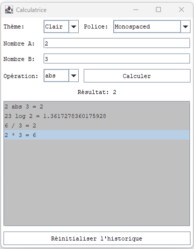

# 🧮 Calculatrice Java Swing 🖥️

 

> **Calculatrice de bureau** performante, écrite en Java avec Swing.

---

## ✨ Fonctionnalités

| Catégorie            | Opérations disponibles                                      |
|----------------------|-------------------------------------------------------------|
| **🔢 De base**       | `+`, `-`, `*`, `/`, `%`, `^`                                |
| **🧮 Avancées**      | `√`, `abs`, `log₁₀`, `!`                                    |
| **🕒 Historique**    | Liste des calculs, réinitialisation via bouton dédié        |
| **🎨 Thèmes**        | Clair / Sombre (switch dynamique)                          |
| **🔤 Polices**       | `SansSerif`, `Serif`, `Monospaced` (sélection dynamique)    |

---

## 📸 Aperçu



---

## ⚙️ Prérequis

- **Java 8** ou supérieur
- **Maven** (optionnel) ou tout autre outil de compilation Java

---

## 📂 Structure du projet

À la racine du projet (au même niveau que `src/`), créez un dossier `docs/` puis à l’intérieur, un sous-dossier `images/` pour y placer vos captures d’écran :

```
<racine-projet>/
├── src/
│   └── calculator/
│       ├ CalculatorModel.java   # Logique des opérations
│       ├ CalculatorUI.java      # Interface graphique (Swing)
│       └ Main.java              # Point d'entrée
├── docs/
│   └── images/
│       └── screenshot.png
└── README.md
```

---

## 🚀 Installation & Exécution

### 📦 Compilation (Ligne de commande)

```bash
# Compiler
javac -d out src/calculator/*.java
# Exécuter
java -cp out calculator.Main
```

### 🛠️ Avec Maven

```bash
# Assurez-vous d’avoir un pom.xml standard
mvn compile exec:java -Dexec.mainClass="calculator.Main"
```

---

## 📝 Utilisation

1. **Entrer** les opérandes dans les champs "Nombre A" et "Nombre B".
2. **Sélectionner** l'opération dans le menu déroulant.
3. **Cliquer** sur **Calculer** pour voir le résultat.
4. **Historique**:
   - S’affiche automatiquement sous le résultat.
   - **Réinitialiser** via le bouton dédié.
5. **Thèmes et polices**:
   - Choisissez **Clair** ou **Sombre**.
   - Sélectionnez la police souhaitée.

---

## 🤝 Contribuer

Les contributions sont bienvenues !
1. Forkez le dépôt
2. Créez votre branche (`git checkout -b feature/ma-fonctionnalite`)
3. Commitez vos modifications (`git commit -m 'Ajout de ...'`)
4. Pushez (`git push origin feature/ma-fonctionnalite`)
5. Ouvrez une Pull Request

---

## 🖊️ Auteur

**Emilie-Rose**  
📅 Mise à jour : Juin 2025

---

© 2025 Emilie-Rose.
